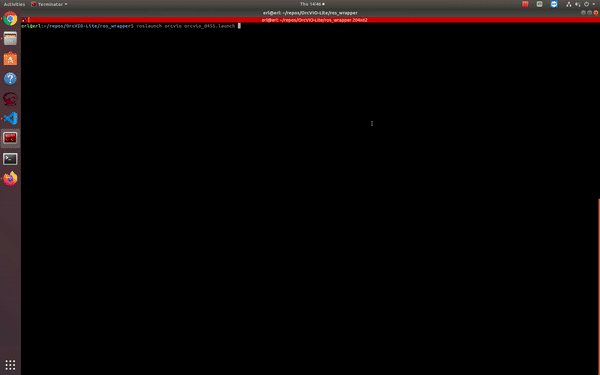

## About 

- Object residual constrained Visual-Inertial Odometry (OrcVIO) is a visual-inertial odometry pipeline, which is tightly coupled with tracking and optimization over structured object models. It provides accurate trajectory estimation and large-scale object-level mapping from online **Stereo+IMU** data.

- OrcVIO-Lite only uses **bounding boxs** and no keypoints. The object mapping module and VIO module are implemented in separate ROS nodelets and are decoupled.  

- Related publication: [OrcVIO: Object residual constrained Visual-Inertial Odometry](https://arxiv.org/pdf/2007.15107.pdf), this is the journal version submitted to T-RO. [Project website](https://moshan.cf/orcvio_githubpage/)

### Citation

```
@inproceedings{shan2020orcvio,
  title={OrcVIO: Object residual constrained Visual-Inertial Odometry},
  author={Shan, Mo and Feng, Qiaojun and Atanasov, Nikolay},
  booktitle={2020 IEEE/RSJ International Conference on Intelligent Robots and Systems (IROS)},
  pages={5104--5111},
  year={2020},
  organization={IEEE}
}   
```

## 1. Prerequisites

This repository was tested on Ubuntu 18.04 with [ROS Melodic](http://wiki.ros.org/melodic/Installation). 

The core algorithm depends on `Eigen`, `Boost`, `Suitesparse`, `Ceres`, `OpenCV`, `Sophus`, `GTest`


## 2. Installation

### ROS version

- Environment is `Ubuntu 18.04` with ROS `Melodic`
- The ROS version also depends on [catkin simple](https://github.com/catkin/catkin_simple), please put it in the `ros_wrapper/src` folder

```
$ git clone --recursive https://github.com/shanmo/OrcVIO-Stereo-Mapping.git
$ cd OrcVIO-Stereo-Mapping/ros_wrapper
$ catkin_make
$ source ./devel/setup.bash
```

## 3. Demo 

- Download [ERL indoor dataset (chairs)](https://www.dropbox.com/s/mwmv5ql3ht1i61n/d455_one_way_demo_bboxes.bag?dl=0), which was collected with [Realsense D455](https://www.intelrealsense.com/depth-camera-d455/) in Existential Robotics Lab, University of California San Diego

- Please refer to [wiki](https://github.com/shanmo/OrcVIO-Stereo-Mapping/wiki) regarding how to setup D455  

- Run `roslaunch orcvio orcvio_d455.launch` generates the result below 



## License

```
MIT License
Copyright (c) 2021 ERL at UCSD
```

## Reference 

- [LARVIO](https://github.com/PetWorm/LARVIO)
- [MSCKF](https://github.com/KumarRobotics/msckf_vio)
- [OpenVINS](https://github.com/rpng/open_vins)
- [OpenVINS eval](https://github.com/symao/open_vins)
